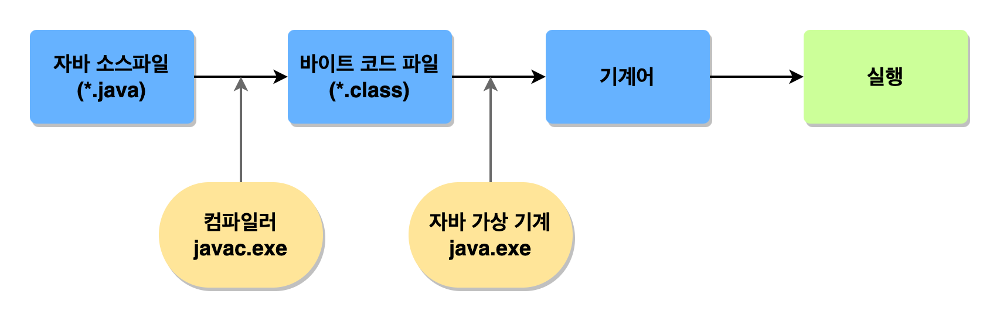

# 자바 기본서 '이것이 자바다' 참조

## 1.1 프로그래밍 언어란?
### 1. 고급 언어 
- 컴퓨터와 대화할 수 있도록 만든 언어 중 사람이 쉽게 이해할 수 있는 언어이다.
- 고급 언어로 작성된 소스는 컴퓨터가 바로 이해할 수 없기에 `컴파일(compile)` 과정을 통해 기계어로 변환해야 한다.
- 일반적으로 `프로그래밍 언어`라고 하면 고급 언어를 말한다.
- 대표적으로 `C`, `C++`, `자바(Java)`가 모두 고급 언어이다.
- 고급 언어로 작성된 내용을 소스(source)라 부른다.

> 소스(source) -> 컴파일러(compiler) -> 기계어로 변환 -> 컴퓨터에서 실행

### 2. 저급 언어
- 기계어에 가까운 언어를 말한다.
- 저급 언어는 사람이 쉽게 이해할 수 없다.
- 대표적으로 `어셈블리어`가 저급 언어이다.

## 1.2 자바란?
### 1. 자바 소개
- 1991년 썬의 엔지니어들에 의해 고안된 오크(Oak)라는 언어에서 시작됐다.
- 1995년 처음으로 썬 마이크로시스템즈(Sun Microsystems)에서 자바 언어를 발표했다.

### 2. 자바의 특징
- 이식성이 높다.
  - 이식성이란? 
  서로 다른 실행 환경을 가진 시스템간에 프로그램을 옮겨 실행할 수 있는 것을 말한다.
- 자바는 100% 객체 지향 언어이다.
  - 객체 지향 프로그래밍(OOP:Object Oriented Programming)이란? 
  프로그램을 개발하는 기법으로 부품에 해당하는 객체들을 먼저 만들고, 이것들을 하나씩 조립 및 연결해서 전체 프로그램을 완성하는 기법을 말한다.
  - 객체 지향 언어가 가져야 할 캡슐화, 상속, 다형성 기능을 완벽하게 지원하고 있다.
- 함수적 스타일 코딩을 지원한다.
  - 최근 함수적 프로그래밍이 다시 부각되는 이유는 대용량 데이터의 병렬 처리, 이벤트 지향 프로그래밍에 적합해서이다.
  - 자바는 함수적 프로그래밍을 위해 람다식을 자바 8부터 지원한다.
  - 람다식을 사용하면 컬렉션의 요소를 필터링, 매핑, 집계 처리하는데 쉬워지고, 코드가 매우 간결해진다.
- 메모리를 자동으로 관리한다.
  - 자바는 개발자가 직접 메모리에 접근할 수 없도록 설계되어있다.
  - 메모리는 자바가 직접 관리한다.
  - 객체 생성시 자동으로 메모리 영역을 찾아서 할당한다.
  - Garbage Collector를 실행시켜 사용하지 않는 객체를 제거시켜준다.
- 다양한 애플리케이션을 개발할 수 있다.
  - 자바는 다양한 운영체제(OS: Operating System)에서 실행되는 프로그램을 개발할 수 있다.
  - 자바는 다양한 운영체제에서 사용할 수 있는 개발 도구와 API를 묶어 에디션(Edition) 형태로 정의하고 있다.
  
    - Java SE(Standard Edition) - 기본 에디션
    : Java SE는 자바 프로그램들이 공통적으로 사용하는 자바 가상 기계(JVM:Java Virtual Machine)을 비롯해서 자바 프로그램 개발에 필수적인 도구와 라이브러리 API를 정의한다. 
클라이언트와 서버 프로그램에 상관없이 자바 프로그램을 개발하고 실행하기 위해서는 반드시 Java SE 구현체인 자바 개발 키트(JDK: Java Development Kit)를 설치해야 한다.
    
    - Java EE(Enterprise Edition) - 서버용 애플리케이션 개발 에디션
      : Java EE는 분산 환경(네트워크, 인터넷)에서 서버용 애플리케이션을 개발하기 위한 도구 및 라이브러리 API를 정의한다.
    서버용 애플리케이션으로는 Servlet/JSP를 이용한 웹 애플리케이션, 분산 처리 컴포넌트인 EJB(Enterparise Java Bean) 그리고 XML 웹 서비스(Web Services) 등이 있다.

- 멀티 스레드(Multi-Thread)를 쉽게 구현할 수 있다.
  - 하나의 프로그램이 동시에 여러 가지 작업을 처리해야 할 경우와 대용량 작업을 빨리 처리하기 위해 서브 작업으로 분리해서 병렬 처리하려면 멀티 스레드 프로그래밍이 필요하다.
  - 자바는 스레드 생성 및 제어와 관련된 라이브러리 API를 제공하고 있기 때문에 실행되는 운영체제와 상관없이 멀티 스레드를 쉽게 구현할 수 있다.
- 동적 로딩(Dynamic Loading)을 지원한다.
  - 자바 애플리케이션은 여러 개의 객체가 서로 연결되어 실행되는데, 이 객체들은 클래스로부터 생성된다.
  - 애플리케이션이 실행될 때 모든 객체가 생성되지 않고, 객체가 필요한 시점에 클래스를 동적 로딩해서 객체를 생성한다.
- 막강한 오픈소스 라이브러리가 풍부하다.
  - 자바는 오픈소스(Open Source) 언어이기 때문에 자바 프로그램에서 사용하는 라이브러리 또한 오픈소스가 넘쳐난다.

3. 자바 가상 기계(JVM)
- 운영체제는 자바 프로그램을 바로 실행할 수 없다. 그 이유는 자바 프로그램은 완전한 기계어가 아닌 중간 단계의 바이트 코드이기 때문이다.
- 이 바이트 코드 파일을 해석하고 실행할 수 있는 가상의 운영체제 역할을 하는 게 바로 자바 가상 기계(JVM: Java Virtual Machine)이다.
- JVM을 사용하면서 자바 프로그램이 여러 운영체제에서 동일한 실행 결과가 나오게 된다. 즉, 운영체제에 상관없이 자바 프로그램을 개발할 수 있다.
- 바이트 코드는 모든 JVM에서 동일한 실행 결과를 보장하지만, JVM은 운영체제에 종속적이다.
> 자바 프로그램은 확장자가 .java인 파일(소스파일)을 작성하는 것부터 시작 -> 컴파일러(javac.exe)로 컴파일되면서 확장자가 .class인 바이트 코드 파일이 생성
-> 바이트 코드 파일은 JVM 구동 명령어(java.exe)에 의해 JVM에서 해석 -> 해당 운영체제에 맞게 기계어로 번역

